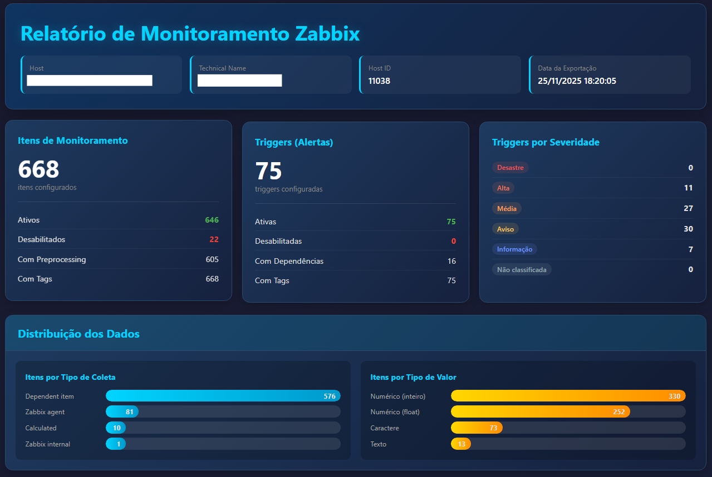
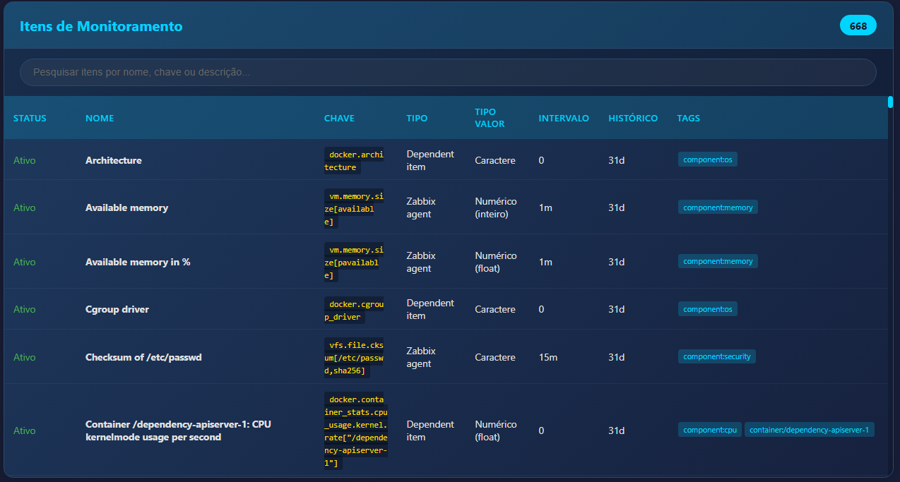
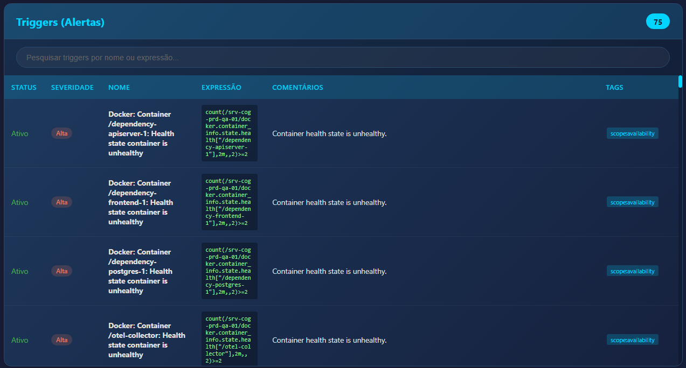
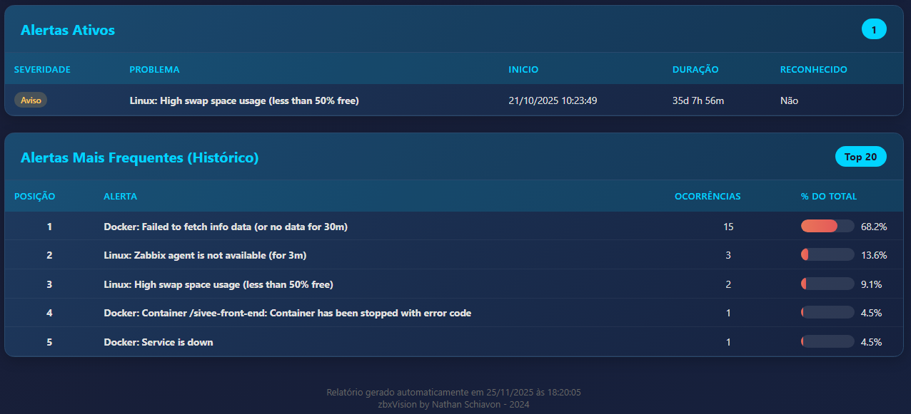

# zbxVision Host Reports

Script Python para exportar dados de host do Zabbix em múltiplos formatos (JSON, HTML e Excel).

##  Requisitos

- Python 3.8+
- Bibliotecas: `pyzabbix`, `openpyxl`, `python-dotenv`

##  Instalação

1. Clone ou baixe os arquivos do script

2. Instale as dependências:
```bash
pip install pyzabbix openpyxl python-dotenv
```

3. Configure as credenciais no arquivo `.env`:
```bash
cp .env.example .env
# Edite o arquivo .env com suas credenciais
```

##  Configuração

Edite o arquivo `.env` com suas informações do Zabbix:

```env
ZABBIX_URL=http://seu-servidor-zabbix
ZABBIX_USER=seu_usuario
ZABBIX_PASSWORD=sua_senha
```

** IMPORTANTE:** Adicione `.env` ao `.gitignore` para não expor suas credenciais!

##  Uso

### Sintaxe básica:
```bash
python export-gerencial.py <hostname> [--format FORMAT]
```

### Exemplos:

```bash
# Gerar apenas Excel
python export-gerencial.py 0101SVDB60 --format excel

# Gerar HTML e JSON (padrão)
python export-gerencial.py 0101SVDB60 --format both

# Gerar todos os formatos
python export-gerencial.py 0101SVDB60 --format all

# Especificar nome de saída customizado
python export-gerencial.py 0101SVDB60 --output meu_relatorio --format excel
```

##  Formatos de Saída

### Excel (.xlsx)
- **Resumo**: Estatísticas gerais
- **Itens**: Todos os itens de monitoramento
- **Triggers**: Alertas configurados
- **Alertas Ativos**: Problemas atuais
- **Top 20 Alertas**: Alertas mais frequentes



### HTML (.html)
- Dashboard interativo com gráficos
- Pesquisa em tempo real
- Visualização profissional







### JSON (.json)
- Dados brutos exportados
- Útil para integrações

##  Opções Avançadas

```bash
# Usar credenciais diferentes
python export-gerencial.py HOST --url http://outro-servidor --user admin --password senha

# Exportar apenas itens
python export-gerencial.py HOST --format json
```

##  Estrutura de Arquivos

```
scripts/
├── export-gerencial.py    # Script principal
├── .env                    # Credenciais (não commitar!)
├── .env.example           # Exemplo de configuração
└── README.md              # Este arquivo
```


